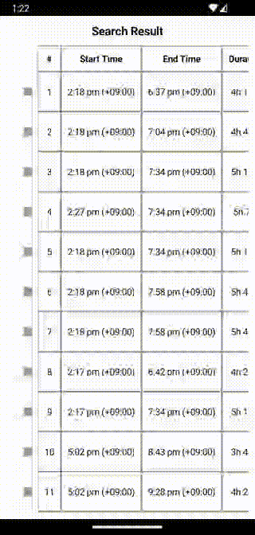

# Composable Table

[](https://jitpack.io/#sunny-chung/composable-table)

An Android Jetpack Compose library that provides a `@Composable` table
with automatic layouts.



## Features
- 2-dimension scrolling
- Automatic cell width and height calculation using the largest one
- Maximum cell width/height could be optionally specified 
- Allowing custom composable and action listeners (e.g. clickable) for each cell
- Infinite table width and height
- Sticky rows and columns
- Straight-forward to use

## What is NOT included
- Lazy cells
- Grid lines (have to be implemented by users themselves inside cells)

## Setup

1. Add the JitPack maven repository.
```kotlin
    repositories {
        // ...
        maven(url = "https://jitpack.io")
    }
```

2. Add this library as a dependency.
```kotlin
    dependencies {
        // ...
        implementation("com.github.sunny-chung:composable-table:<version>")
    }
```

## Usage
Below shows an example of minimal usage.
```kotlin
    Table(
        rowCount = 100,
        columnCount = 10
    ) { rowIndex, columnIndex ->
        Text("($rowIndex, $columnIndex)")
    }
```

Please read the [demo app](demo-app/src/main/java/com/sunnychung/lib/android/composabletable/ux/AppView.kt) for a practical usage example.

## Troubleshooting

If `maxCellWidthDp` or `maxCellHeightDp` is specified, please do not use `fillMaxXXX` modifiers
in the root composable of cells, or the cell would occupy maximum size unconditionally.
This behaviour is [documented](https://developer.android.com/reference/kotlin/androidx/compose/ui/Modifier#(androidx.compose.ui.Modifier).fillMaxWidth(kotlin.Float)) in the `fillMaxXXX` methods of the Compose Foundation library.

## Contribution
Contributions are welcomed!

Please also raise an issue if you think a must-have feature is missing!
